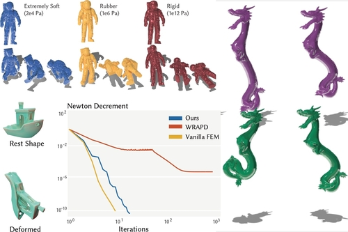

# Mixed FEM




[](https://opensource.org/licenses/MIT)

Open-source reference implementation of *Mixed Variational Finite Elements for Implicit Simulation of Deformables*

## Files

* `apps/`: cpp executables
* `cmake/`: CMake files
* `deps/`: dependencies
* `models/`: input meshes
* `scenes/`: json scripts for different examples
* `scripts/`: miscellaneous matlab scripts
* `src/`: source code
* `tests/`: unit-tests (they all fucked right now)

## To download and build

```
git clone --recurse-submodules https://github.com/tytrusty/mixed-fem.git
cd mixed-fem
mkdir build
cd build
cmake ..
make -j4
```

## Usage

There are two simulation executables for 2D and 3D simulation, which in the build directory will be `bin/sim2d` and `bin/sim3d`. The best way to use these executables is by passing in a scene JSON file, which we include examples of and an outline of the format in the `scenes` directory.

For example from your build directory try executing:
```
./bin/sim2d ../scenes/2D/trampoline.json
```

After launching the application, you can use the GUI to start/stop/reset the simulation as well as modify many of the parameters. Currently there is no headless version since I think the GUI is much more fun :). 

### Dependencies

This project depends on the following libraries

* [Eigen](https://eigen.tuxfamily.org/): linear algebra
* [libigl](https://github.com/libigl/libigl): geometry processing
* [Bartels](https://github.com/dilevin/Bartels): physics (don't think i neeed this anymore)
* [polyscope](https://github.com/nmwsharp/polyscope): GUI

#### If unit tests are enabled:
* [finite-diff](https://github.com/zfergus/finite-diff): finite difference used in unit tests
* [Catch2](https://github.com/catchorg/Catch2.git): unit testing framework

## Python Bindings

Coming sort of soon (not that soon)